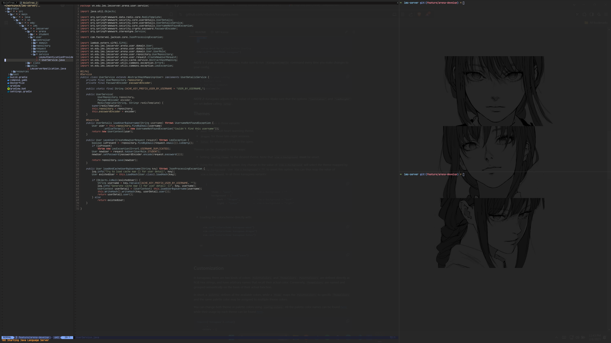
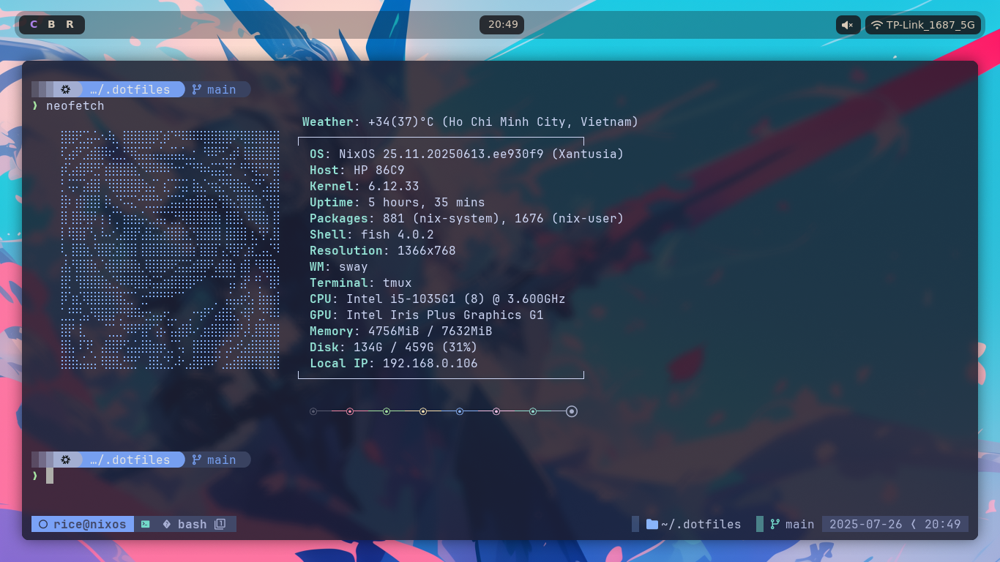
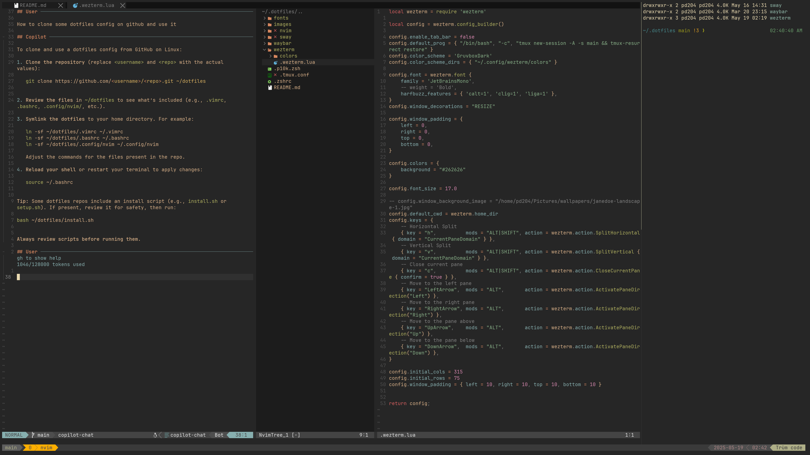
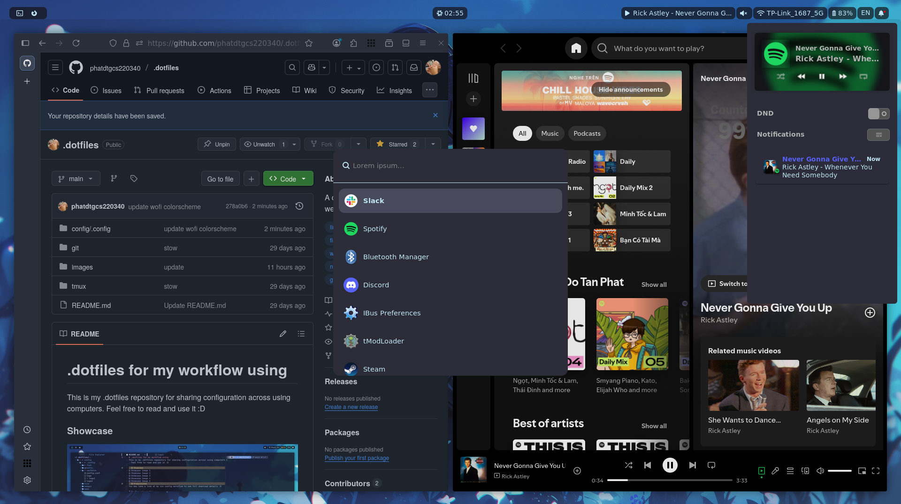

# .dotfiles for my workflow using
This is my .dotfiles repository for sharing configuration across using computers. Feel free to read and use it :D

### Showcase 





### Prequisites 
You may take a look at my nix config workflow to see full download details :D

[Worflow nix config](https://github.com/phatdtgcs220340/nix-config/tree/main/modules/working/workflow)
**GNU Stow**

Each directory is a stow package. Install individual configs with:
```sh
cd ~/.dotfiles
# Install specific tools
stow nvim
stow alacritty
stow fish
stow tmux
stow git

# Or install all at once
stow */
```

To remove a config:
```sh
stow -D nvim
```

[Demo video](https://www.youtube.com/watch?v=JTpX5dNatx8)
