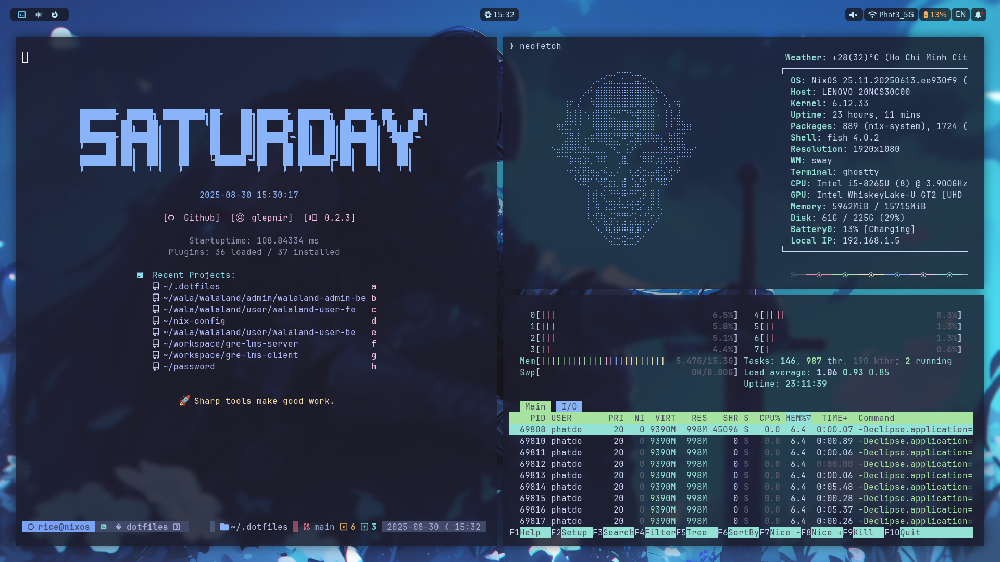

# .dotfiles for my workflow using
This is my .dotfiles repository for sharing configuration across using computers. Feel free to read and use it :D

### Showcase 




### Prequisites 
Need to download these software for using these configs
Wezterm, Tmux, zsh, powerlevel10k, Nvim
### Symbol link 
#### Linux  

Can run for automatically link the config if your config is default

```
chmod +x ./auto-symbol-link.sh
./auto-symbol-link.sh
```

