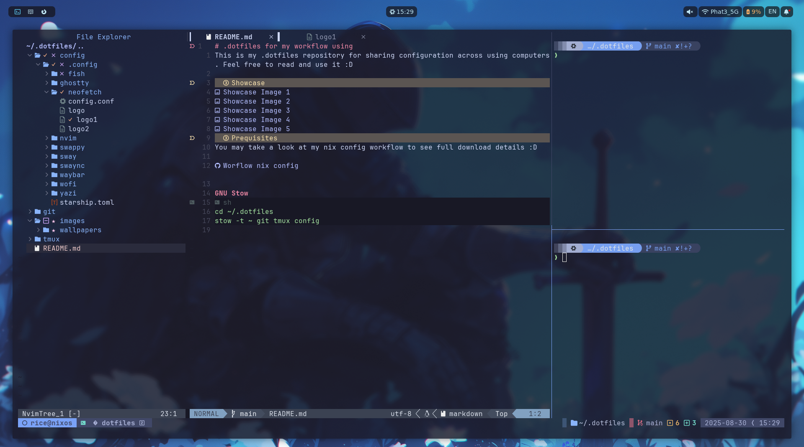

This is my .dotfiles repository for sharing configuration across using computers. Feel free to read and use it :D

### Showcase 



### Prequisites 
Need to download these software for using these configs
Wezterm, Tmux, zsh, powerlevel10k, Nvim
### Symbol link 
#### Linux  

```
# adjust base on your machine 
ln -s ~/.dotfiles/nvim ~/.config/nvim # Nvim 
ln -s ~/.dotfiles/.tmux.conf ~/.tmux.conf # Tmux
ln -s ~/.dotfiles/wezterm/.wezterm.lua ~/.wezterm.lua  # Wezterm
ln -s ~/.dotfiles/wezterm/colors ~/.config/wezterm/colors  # Wezterm
ln -s ~/.dotfiles/.zshrc ~/.zshrc  # zsh
ln -s ~/.dotfiles/.p10k.zsh ~/.p10k.zsh # powerlevel10k
ln -s ~/.dotfiles/fonts /usr/local/share/fonts # Install font into machine
```
